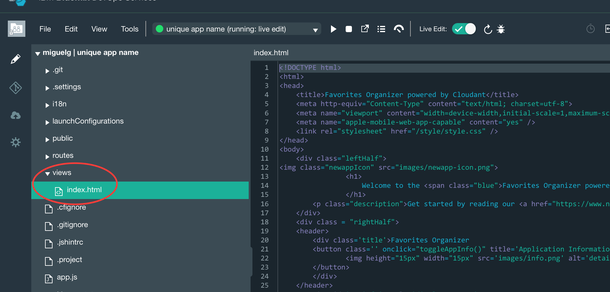

# Creating a NodeJS-Cloudant App in Bluemix -  Tutorial

In this tutorial you will learn how to quickly create a Node.js and Cloudant Application in Bluemix. You will also learn how to edit your code and deploy your changes using the IBM Bluemix DevOps Services.

## Get Your Free Bluemix Account
http://ace.ng.bluemix.net
This will take care of your Sign Up and Log In into the Bluemix portal.

## Let's Create the App.

1. Click on the **Catalog** Tab  

2. From the Boilerplates, click on the **"Node.js Cloudant DB Web Starter"** icon.

	

3. Give your Application a unique name. Click on **Create** button.

	

4. Once your application has finished staging, click on the **URL** to load your app or the **Overview** button to see your application details.

   

**NOTE:** If you clicked on the URL you will see the following web page.
    

5. Click on the **ADD GIT** button to add IBM Bluemix DevOps Services to your app.

    The DevOps Services offer a Git Repository, a Track Project Tool for project management, and a code editing tool with debugger for live edits from your browser. It also generates a delivery pipeline to build, test, and deploy your application on the cloud.

    

6. When Bluemix finishes creating the DevOps services and appending it to your app you will see a URL to your project in DevOps services. Click on that **URL** to open the services.

    

7. Click on the **EDIT CODE** button. (This will load the editor on your browser)

    

8. To Perform live editing, click on the **Live Edit** button to active. This will re-deploy your application to bluemix.

    

9. After the application finishes deploying, click on **views -> index.html** to open/load the index.html file.
    
    

10. Edit the line `Welcome to the Favorites Organizer powered by Cloudant` inside the `<h1> </h1>` brackets. Replace it for `Hello World!`.

    

11. Save the file by clicking **File -> Save**. This tool should automatically change the code in your deployed application. If the application is not live, click on the **play icon** to deploy the changes.

    

12. Go back to your bluemix application overview and click on the URL to load your application.

    

13. The title should be **Hello World!**

    

14. The code starter from the Bluemix boilerplate contains sample code that shows how to connect to Cloudant database. The **app.js** file contains code for the sample starter app.
    
From the code editor, click on **app.js** file to load the file in the editor. Continue implementing your cool app :)
    

## Congrats you have created your first Bluemix application.

Using the IBM Bluemix DevOps services you will be able to collaborate with other people when building applications by pushing code to the git repository, using the project management tool and the handy live code editing tool. 

