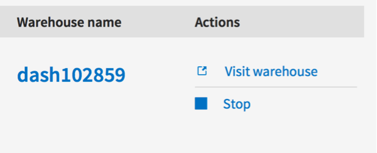

# DashDB Tutorial

## Lab 1 – Basic dashDB Provisioning
1. Provision a dashDB instance in Bluemix. Leave it unbound to an application for now.
2. Launch and explore the dashDB web console interface.

## Lab 2 – Cloudand-dashDB

1. Provision a Cloudant NoSQL DB service instance in Bluemix. Leave it unbound to an application for now.
2. Launch the Cloudant web interface from the Bluemix service.
3. Create a new Cloudant database.

   

4. Create some new documents in the database. Do so by clicking on the plus sign:

   

   Add some simple JSON properties to your documents. E.g. name and age. A resulting doc could look like this:

   ```
{
  "_id": "80fc5c9eb77d51b21f249286d5d40b80",
  "_rev": "2-4e2b16a23575ddbd1277e4e4414d4d98",
  "name": "Paul",
  "age": 25
}
```
   Use the same properties in each JSON doc in your database.

5. Create a new Warehouse for the database that you just created.
 
      
   and specify your Bluemix credentials to the Cloudant console.

6.	Open the dashDB console for the just provisioned warehouse.

    

7.	Explore the tables view and find your Cloudant data in the new table named after your source Cloudant database.

8.	Try a bit more sophisticated Cloudant database by replicating from remote database https://torsten.cloudant.com/nyctaxi to a new local replica in your Cloudant service.

   

   You will be asked to enter your Cloudant password here. This is where it becomes tricky because we don’t know this password normally because Bluemix has signed us on to Cloudant automatically when we launched the Cloudant console. You can find out about the password for any service when it is bound to a Bluemix app. So, take one of your Bluemix apps and bind your Cloudant service to it.

   

   

   Then go to the Envirnment Variables pane for the app and you can find the password for the Cloudant service in there.
   
   

9. Now create a warehouse for this new replica of NYC Taxi data and explore and analyze its data with dashDB. Note: you will first have to delete your previous warehouse from Cloudant service because currently it is only allowed to have one dashDB warehouse instance per Cloudant instance. You could however create a second Cloudant instance in Bluemix alternatively.

## Lab 3 – R analytics Samples

1. Open Analytics → R Script.

2. Explore and execute the provided sample projects, in particular the ones for In-Database Analytics.

3. Try the same samples also in RStudio. Open RStudio. You will be challenged for credentials now. You can find them in dashDB console in Connect → Connection Settings under “Individual database settings”. (An alternative way would have been to bind a Bluemix app and look in the Environment Variables like we had done it in lab 2 for the Cloudant service credentials.)

4. In RStudio select Open File from the File menu and navigate to RSamples directory to find the same set of R sample scripts like in `Analytics` → `R Script`. Open one and execute it with RStudio and explore its functions. Execute the script line by line by placing the cursor on it and click Run, or mark entire document of sections of it and then click Run multiple lines or entire script at once.

## Lab 4 – Data load & R analytics

Roger, the data scientist at San Francisco City Office, needs to analyze the last 11 years of crime data and create plots to uncover data patterns so City can take appropriate safety measures and invest in police force.

_This scenario uses statistical data analysis using R. If you have done programming with R before you will be able to tweak the code and run the deviation. If you have not used R before, do not worry, just follow the steps below._

### Loading the data

5. Roger downloads the SF incident report data that is available in CSV zipped format from:  http://www-01.ibm.com/support/knowledgecenter/api/content/nl/en-us/SS6NHC/com.ibm.swg.im.dashdb.console.doc/sfpd_incident_all_csv.zip.

   _If the network is slow and you can not download the csv.zip then just download 2013 data from here: http://bluforcloud.com/idug/files/sfpd_incident_2013.csv_

6. Unzip the attached file, which contains San Francisco Police Department data for year 2003 to 2014.

7. Open the dashDB console for one of the dashDB services in your Bluemix dashboard. Click on `Load` → `Load from Desktop` from the main menu.

8. Browse and select `sfpd_incident_2003.csv` file from the unzipped folder in Step 2.

9. Use default options and click on the `Load File` button.

   
 
10.	If you get an alert message, just click OK and the file upload will start. Once the upload is complete you will see a preview of the data. Click on the `Next` button.

   

11.	Choose `Create a new table and load` at the first time when you are loading and then click on `Next`.

   

12.	Change the table name as you would like and click on `Finish`.

   

13.	After Quick Load succeeds you can add more files using the `Load more data` link.

   _You can choose not to load all yearly data to save time._

   

14.	Repeat steps 4 through 9, except steps 7 and 8 where you need to select option `Load into an existing table`, for loading data for years 2004 to 2014 into the same table. 

   Select the Schema and Table Name and then `Finish`.

   
 
 
## Running R scripts
1. Download a sample R script from here: http://bluforcloud.com/idug/files/sfpd.R
2. Click `Analytics` → `R Script`. Click `Import` and import the R script you just downloaded.
3. Save and give it a name (eg. `Sfpd.R`). This should be saved under `My Projects`.
4. Adapt the table name in the select according to the target table that you have used to load the data.
5. Click `Submit` to run. Once it is complete, click on Plots to view the plots.

   

6. You can also launch R studio, access the script and run it.

7. Browse the different plots that were created and enjoy.

8. Try the same script in RStudio.

 
## Lab 5 – Twitter-dashDB data load

1. Open https://hub.jazz.net/project/torsstei/Twitter-Loader/overview to open the Twitter-dashDB loader application in JazzHub.

2. Click on `Deploy to Bluemix`. 

3. Provide your Bluemix credentials to log in if needed.

4. Customize the app name if desired. This will also be the basis for the app URL.

5. Click on deploy and wait for the deployment to finish. It will create also a new dashDB instance with your Bluemix ID and bind the loader app to it. I.e. the app will load the Tweets into that database.

6. Click `View Your App` to launch it.

7. Play with the search terms (using “Count Tweets”) to find a good set of tweets you want to load into dashDB and then type a table name click “Insert Tweets”. 

8. Open dashDB console for the new dashDB instance by looking for it in your Bluemix dashboard.

9. Find the Tweet data in the according table in dashDB.

10.	Bind the Twitter loader app to another dashDB instance that you have created before and see how you can then use it to load the Tweets there.
